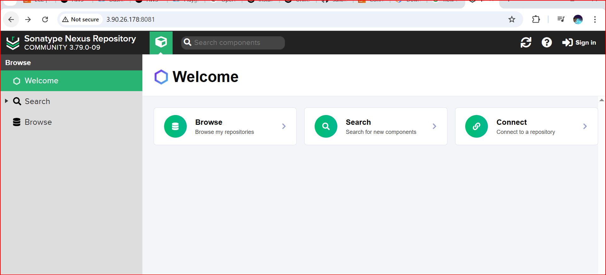
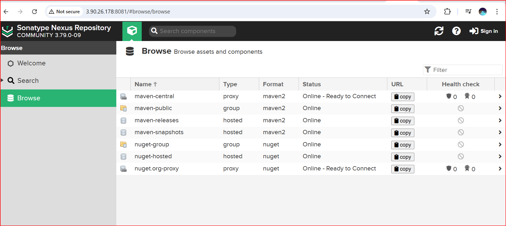
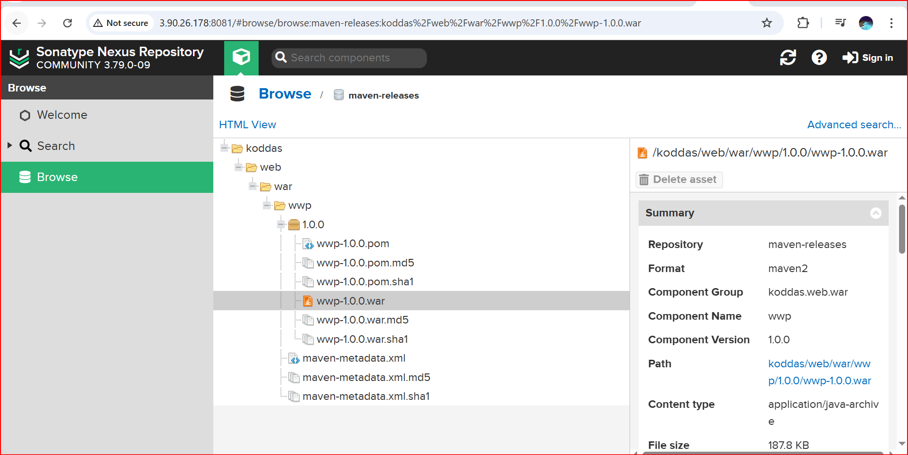

## Two Server Setup for Build and Release Servers

Nexus is a repository manager (build repo) that centralizes the storage and management of software artifacts like binaries and packages. It supports formats such as Maven, npm, Docker, and more. Nexus integrates with CI/CD pipelines, helps enforce security policies, and ensures version control, making it easier to manage and deploy dependencies efficiently.

By using Nexus, organizations can:
- Manage and version all artifacts in one centralized location.
- Enforce security policies and control access to critical components.
- Protect the software supply chain.
- Maintain a reliable backup of all artifact versions.

---

## Release Server Setup

### Install and Configure Nexus Repository on Release Server

**Minimum Requirements for Nexus Repo**
- **Cores:** 2 CPU / 4 GB RAM
- **Port Open:** 8081

**Log in to your server and update it**
```bash
sudo apt update -y
```

**Install Java**
```bash
sudo apt install openjdk-17-jdk-headless
java --version
```

Sample Output:
```bash
ubuntu@Release:~$ java --version
openjdk 17.0.14 2025-01-21
OpenJDK Runtime Environment (build 17.0.14+7-Ubuntu-124.04)
OpenJDK 64-Bit Server VM (build 17.0.14+7-Ubuntu-124.04, mixed mode, sharing)
```

### Download Nexus
```bash
cd /opt
sudo wget https://download.sonatype.com/nexus/3/nexus-3.79.1-04-linux-x86_64.tar.gz
sudo tar -xvf nexus-3.79.1-04-linux-x86_64.tar.gz
```

### Create Nexus User Profile
```bash
sudo adduser nexus
```

Sample Output:
```bash
ubuntu@Release:/opt$ sudo adduser nexus
New password:
Retype new password:
passwd: password updated successfully
Changing the user information for nexus
Enter the new value, or press ENTER for the default
Is the information correct? [Y/n] y
info: Adding new user `nexus' to supplemental / extra groups `users' ...
info: Adding user `nexus' to group `users' ...
```

### Change Ownership of Nexus and Work Directory
```bash
sudo chown -R nexus:nexus /opt/nexus
sudo chown -R nexus:nexus /opt/sonatype-work
```

Sample Output:
```bash
ubuntu@Release:/opt$ ll
total 412244
drwxr-xr-x  4 root root      4096 Apr 16 07:09 ./
drwxr-xr-x 22 root root      4096 Apr 16 07:03 ../
drwxr-xr-x  7 root root      4096 Apr 16 07:08 nexus/
-rw-r--r--  1 root root 422117063 Apr 10 18:13 nexus-3.79.1-04-linux-x86_64.tar.gz
drwxr-xr-x  3 root root      4096 Apr 10 13:56 sonatype-work/
```

### Create Nexus Service File
```bash
sudo vi /etc/systemd/system/nexus.service
```

Paste the following content:
```ini
[Unit]
Description=nexus service
After=network.target

[Service]
Type=forking
LimitNOFILE=65536
ExecStart=/opt/nexus/bin/nexus start
ExecStop=/opt/nexus/bin/nexus stop
User=nexus
Restart=on-abort

[Install]
WantedBy=multi-user.target
```

### Start and Enable the Nexus Server
```bash
sudo systemctl daemon-reload
sudo systemctl enable nexus
sudo systemctl start nexus
sudo systemctl status nexus
```

Sample Output:
```bash
ubuntu@Release:/opt$ sudo systemctl status nexus
=> nexus.service - nexus service
     Loaded: loaded (/etc/systemd/system/nexus.service; enabled; preset: enabled)
     Active: active (running) since ...
     ...
```

### Check Public IP and Running Port
```bash
sudo apt install net-tools -y
curl ifconfig.me
netstat -ntpl
```

Sample Output:
```bash
ubuntu@Release:/opt$ curl ifconfig.me
54.234.203.250
ubuntu@Release:/opt$ netstat -ntpl
(No info could be read for "-p": geteuid()=1000 but you should be root.)
Active Internet connections (only servers)
Proto Recv-Q Send-Q Local Address           Foreign Address         State       PID/Program name
tcp        0      0 127.0.0.54:53           0.0.0.0:*               LISTEN      -
tcp        0      0 127.0.0.1:6010          0.0.0.0:*               LISTEN      -
tcp        0      0 127.0.0.53:53           0.0.0.0:*               LISTEN      -
tcp6       0      0 :::8081                 :::*                    LISTEN      -
tcp6       0      0 ::1:6010                :::*                    LISTEN      -
tcp6       0      0 :::22                   :::*                    LISTEN      --
```

### Access Nexus
```bash
http://<your-server-ip>:8081
```

Login with initial admin password:
```bash
cat /nexus-data/admin.password
```

Then reset the password in the UI.

---



## Build Server Setup

### Login into Build Server, Update, and Install Prerequisites
```bash
sudo apt update -y
sudo apt install openjdk-17-jdk-headless
sudo apt install git -y
sudo apt install maven -y
```

### Clone Your Java Code
```bash
cd ~
git clone https://github.com/saikrishna8763/buildtasks.git
```

### Navigate to Your Repository
```bash
cd <your-repo>
```

### Update `pom.xml` to Add Nexus Repository Details
Insert the following after `</dependencies>`:
```xml
<distributionManagement>
    <repository>
        <id>repo-id</id> <!-- Repository ID, used for authentication -->
        <url>http://<repo-ip>:8081/repository/maven-releases/</url> <!-- Replace with your actual repository URL -->
    </repository>
</distributionManagement>
```

### Store Nexus Credentials in Maven Settings
```bash
vim /etc/maven/settings.xml
```

Paste the following under `<servers>`:
```xml
<server>
    <id>maven-releases</id>
    <username>admin</username>
    <password>password</password>
</server>
```

### Deploy Artifact to Nexus
```bash
mvn deploy
```

### Verify Deployment in Nexus UI
Go to:
```text
Browse --> maven-releases (or your component) --> Click on version number
```



Here’s a clear and polished version of your note, suitable for inclusion in the **Nexus Setup Guide** under a new section like “### Downloading Artifacts Directly from Nexus”:

---

### Downloading Artifacts Directly from Nexus

You can directly download a `.war` or other artifact by using the full path from the Nexus releases repository, as shown below:

```bash
wget http://54.234.203.250:8081/repository/maven-releases/ua/sergiishapoval/webcarrental/WebCarRental/1.0/WebCarRental-1.0.war
```

You can obtain the download link by navigating to the desired artifact version in the Nexus UI, then copying the path shown.



