# real-time java web application.

# my project git repository
https://github.com/koddas/war-web-project

## A detailed guide for creating a real-time Python web application using maven,tomcat and deploying it on an AWS EC2 instance launched from a custom Amazon Machine Image (AMI).

## prerequisites for this application

### Am using AMI (ubuntu) machine

1. install java :using (wget) command
wget https://download.oracle.com/java/17/archive/jdk-17.0.12_linux-aarch64_bin.tar.gz (sha256 )

2. Before that we do "sudo apt update" (command)

3. install maven 
4. install tomcat :using (wget) command
   (install tomcat in /opt folder)
wget https://dlcdn.apache.org/tomcat/tomcat-10/v10.1.40/bin/apache-tomcat-10.1.40.zip

# Step-by-Step Task Instructions.

## now we have Configure an EC2 Instance.

Log in to the AWS Management Console and navigate to the EC2 dashboard. Launch an Instance: - Click on "Launch Instance." - Choose the Amazon Linux 2 AMI. - Select an instance type t2.micro (or) t2.mediom for the free tier.

img<> 
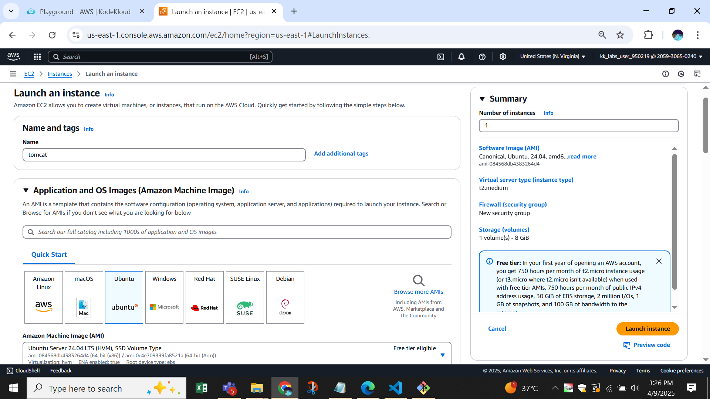

Click "Next: Configure Instance Details." Configure
Instance Details: - Leave default settings or customize as needed. - Click "Next: Add Storage." Configure Storage: - Default settings are usually fine (8 GiB) "
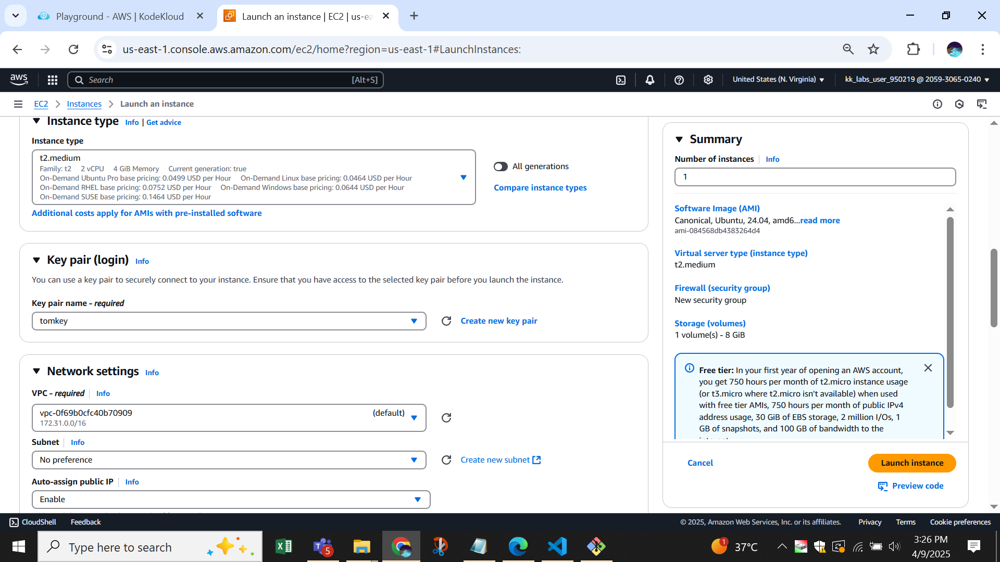

'Add any tags for organization, Key: pyt, Value: tomcat. - Click "Next: Configure Security Group." Configure Security Group: - Create a new security group. - Add the following rules:
http-80 (web)
ssh-22 (security), Custom TCP-8080
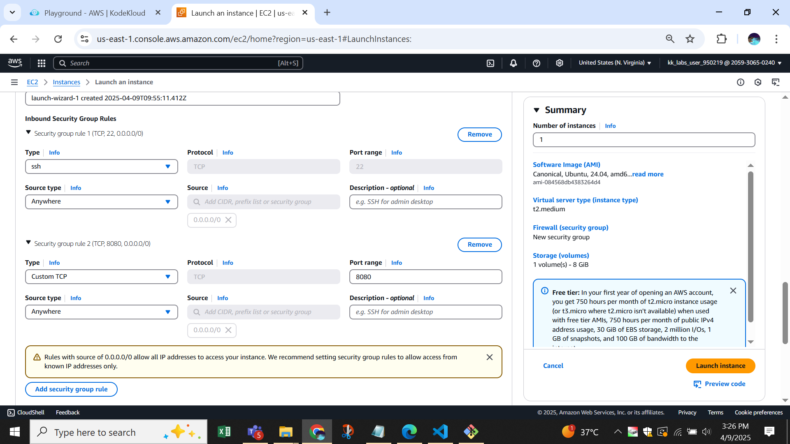

### Click "Review and Launch In stance

Connect via SSH: ssh -i your-key.pem 
ec2-user@your-public-insteance 
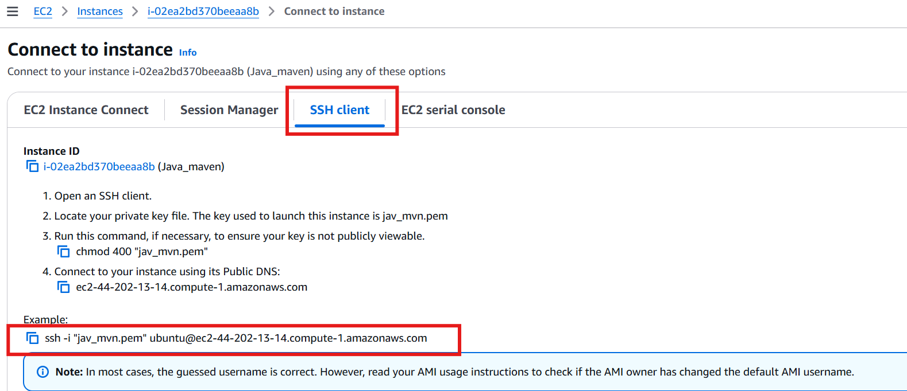

## Now configure ssh connect to your git bash 
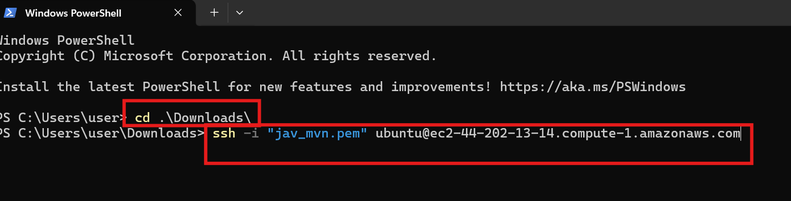

# Install Required Packages
. Update the Package Repository: sudo apt update -y
. : sudo apt install java 
. Install tomcat: sudo apt install tomcat :(/opt fplder)
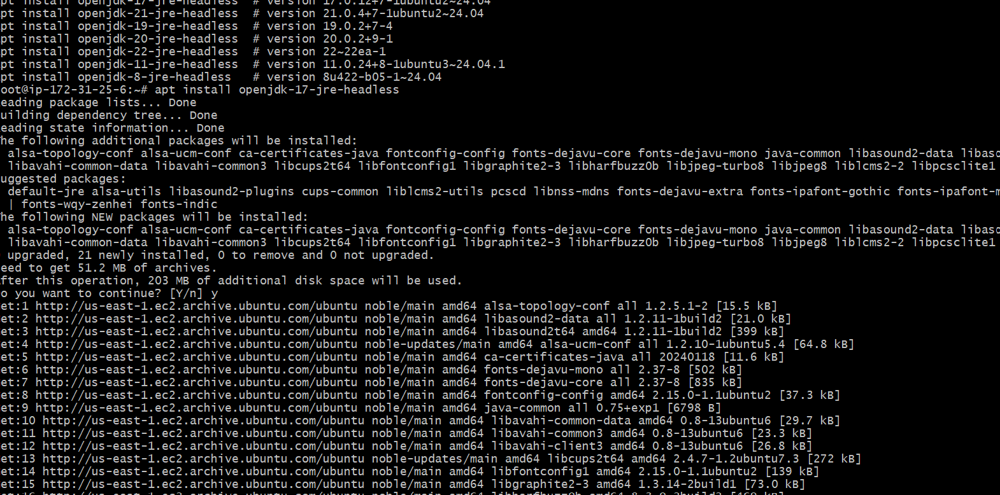

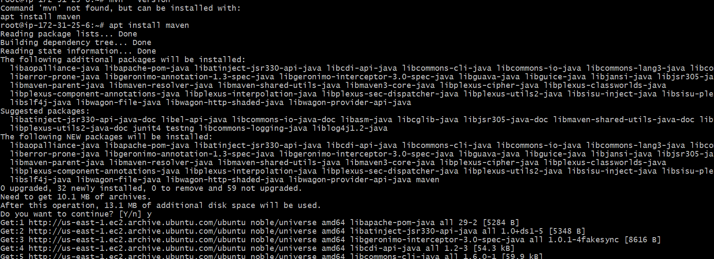

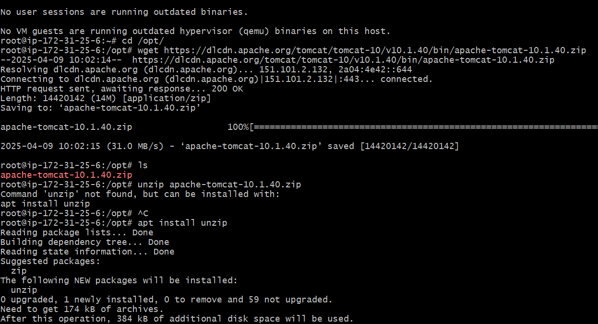

# clonr your project git repository
https://github.com/koddas/war-web-project

'Now go to tomcat path and got config folder using cd conf in the conf we have tomcat user.xmlfile in that and remove comment admin and user.
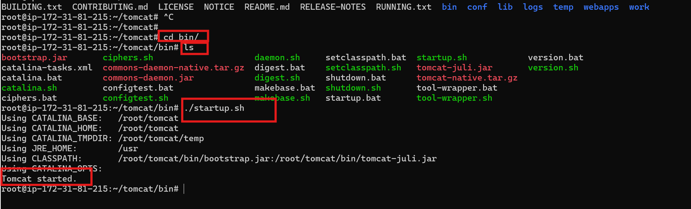

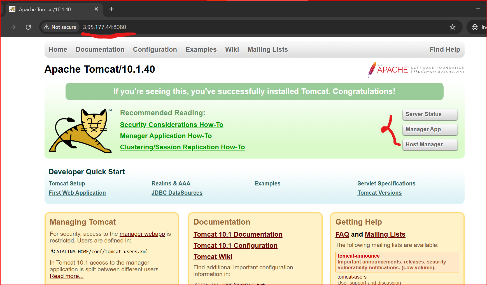

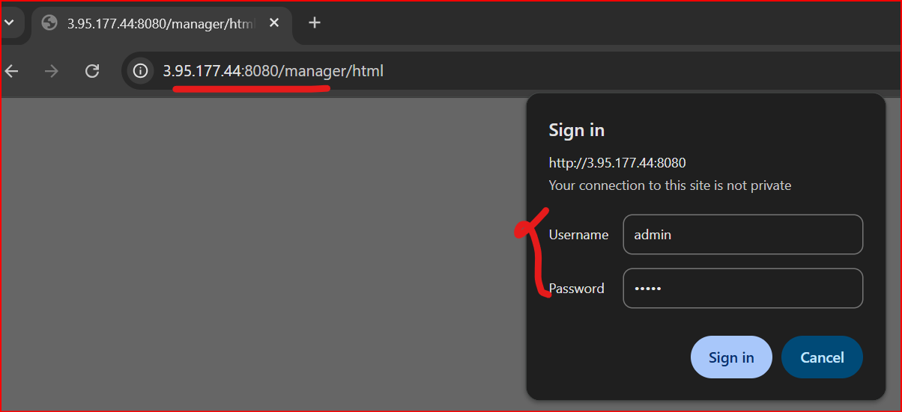

then got to webapps in that we have manager and host manger in this both folder we have meta-info inat both we have config.xml we comment that .By default, Apache Tomcat deploys web applications from the webapps directory located in the Tomcat home folder. If you want to change this location 
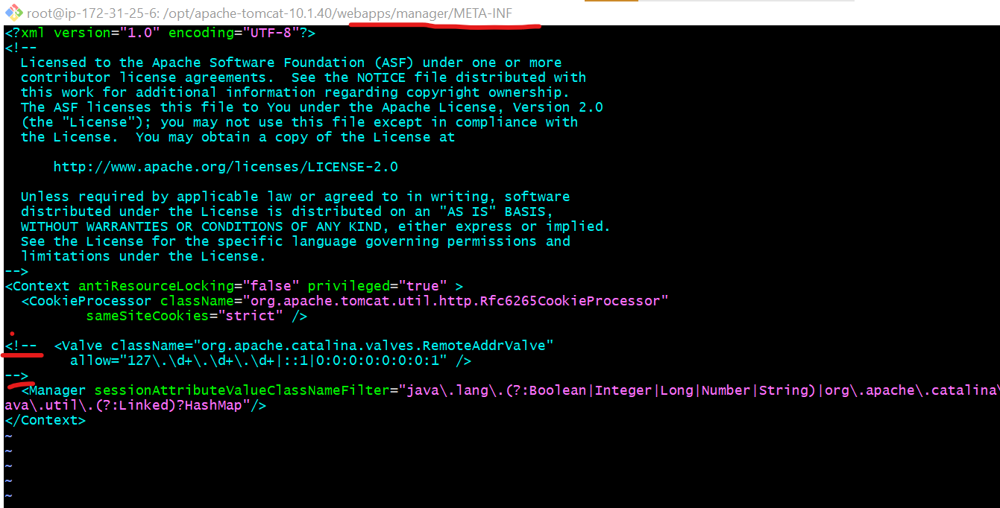
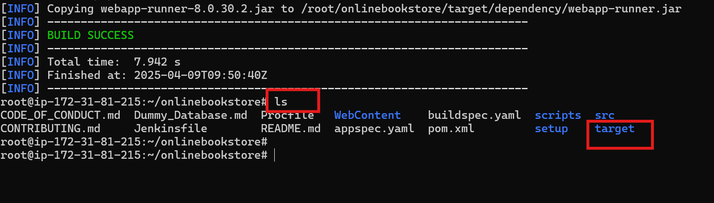
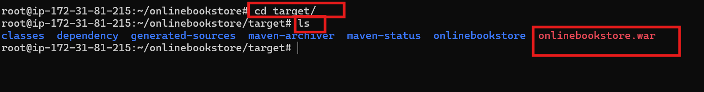 

then you start your tomcat using "./startup.sh"

# Now got to ur project
cd web-project
## build this project
use the command line to build the project as well. To do so, you need to have Maven installed on your machine. Navigate to your project location."mavn package"

Now you get target folder in taht target folder we have artifact like war file : that war file move to tomcat webapps 

Now go to ur your insteance server and copy out publiv ip address past in google like this : 54.174.189.0:8080/wwp-1.0.0/
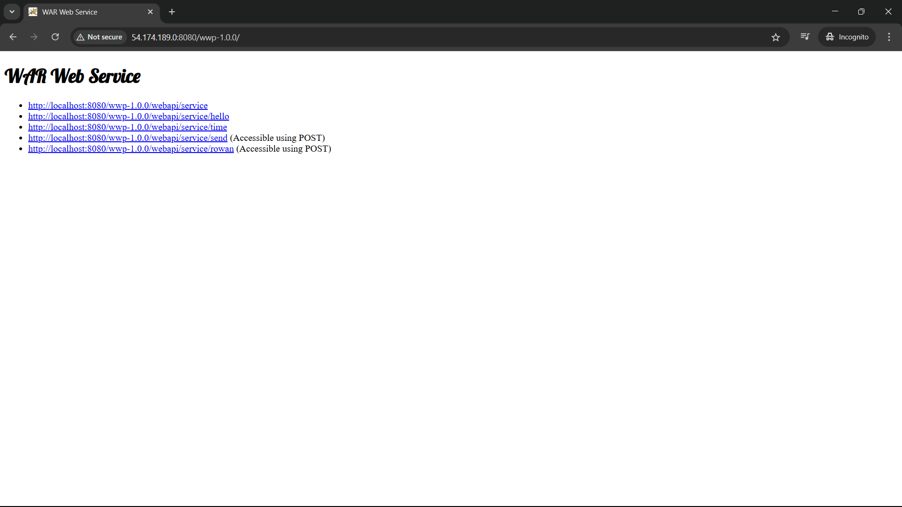

